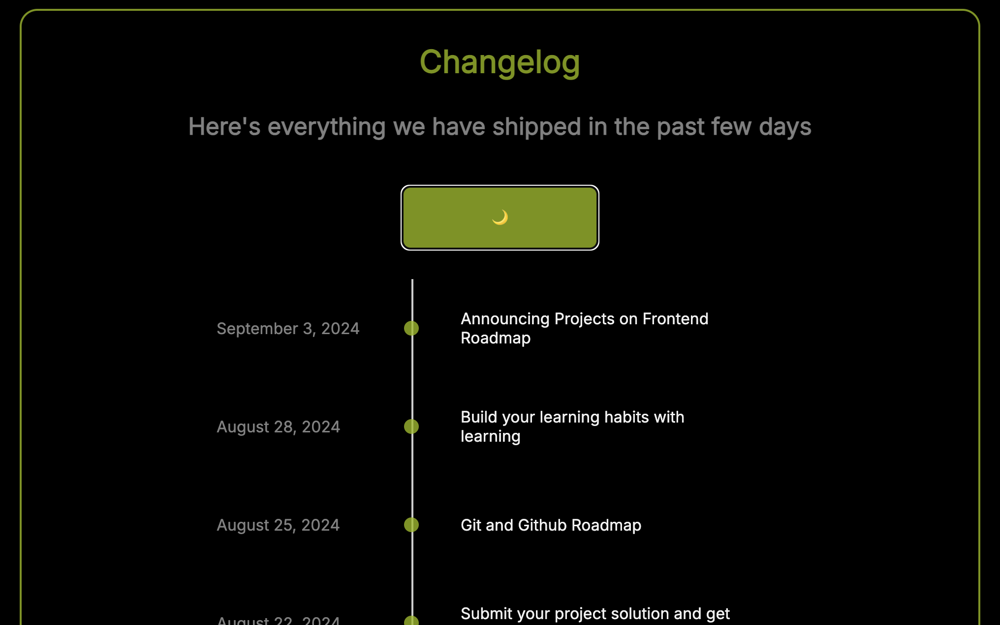

# 🧾 Changelog Timeline

A simple, responsive changelog timeline built with HTML and CSS. This project was designed to practice modern CSS layout techniques, theming with CSS variables, and clean semantic structure. It includes support for dark mode via a toggle button.

---

## 🔗 Project Brief

You can find the original project brief here:  
👉 [Project Brief](https://roadmap.sh/projects/changelog-component)

---

## 🖼 Screenshot

---

## ✨ Features

- Fully responsive layout
- Vertical timeline with date, event, and dot marker
- Dark mode toggle with smooth transitions
- Clean and semantic HTML structure
- Themed with CSS variables for easy customization

---

## 🎨 Technologies Used

- HTML5
- CSS3
  - Flexbox
  - CSS Variables
  - Transitions
  - Responsive design
- (Optional) JavaScript (if theme toggle is implemented)

---

## 🛠 How to Use

1. Clone or download the repository
2. Open `index.html` in your browser
3. Click the **“Toggle Theme”** button to switch between light and dark mode

---

## 📁 File Structure

├── index.html
├── styles.css
└── README.md

---

## 💡 What I Learned

- How to build a responsive timeline layout using Flexbox
- How to use CSS variables for theming and dark mode
- How to structure and debug visual layout using borders and step-by-step testing
- How to isolate visual behavior by setting explicit heights and nesting logic

---

## 📌 Future Improvements

- Add animation to the dot when toggling themes
- Load user’s preferred theme using `localStorage`
- Add hover effects and richer styling details

---

## 🙋‍♂️ Author

**Joshua Agbor**  
Freelance Web Designer & Developer  
[Phttps://github.com/buildinrythm](#) | [joshuaagbor@gmail.com](#)
